# Ryda Financial System — Flow Diagram & Changed Tables

Batch 4 deliverable. This is the standalone reference document Batch 4
asked for; the day-by-day narrative of *why* each change was made,
what was found already working vs. genuinely missing, and how each
piece was verified lives in `README.md` (search for `## Batch 4`).
This document is the map; the README is the log.

## 1. Financial flow diagram

```mermaid
flowchart TD
    subgraph RidePayment["Ride / delivery payment"]
        RC[Ride or delivery completed] --> FareCalc[Backend calculates\nauthoritative final fare\n— never trusts the client]
        FareCalc --> Method{Payment method}
        Method -->|Card on file| Card[PaymentsService.chargeSavedCard]
        Method -->|Bank transfer| Bank[PaymentsService.initBankTransfer]
        Method -->|Wallet| WalletDebit[WalletsService.debit\nride_payment]
        Method -->|Cash| CashFlow[Driver collects cash directly]

        Card --> PaystackConfigured{Paystack\nconfigured?}
        Bank --> PaystackConfigured
        PaystackConfigured -->|No| Simulated[payment_records row,\nstatus=SUCCESS, simulated=true\n— dev/CI only, blocked in\nproduction by\nassertProductionPaymentsAreConfigured]
        PaystackConfigured -->|Yes| PaystackCharge[Real Paystack charge]
        PaystackCharge --> PaymentRecord[(payment_records)]
        Simulated --> PaymentRecord

        CashFlow --> CommissionOwed[Commission becomes payable]
        CommissionOwed --> DebitAttempt{Debit driver/fleet\nwallet now}
        DebitAttempt -->|Succeeds| WalletLedger
        DebitAttempt -->|Insufficient balance| RecordDebt[ReconciliationService.recordDebt\n— trip still completes,\nnever silently lost]
        RecordDebt --> CashRecon[(cash_reconciliations)]
    end

    subgraph Ledger["Wallet ledger — every balance change"]
        WalletDebit --> WalletLedger[WalletsService.debit/credit\n— row-locked transaction:\nbalance + ledger row\nwritten atomically]
        WalletLedger --> Wallets[(wallets.balance)]
        WalletLedger --> WalletTx[(wallet_transactions\nbalanceAfter recorded\non every row)]
    end

    subgraph TopUp["Wallet top-up"]
        TU[POST /wallet/topup/init] --> TUGuard{Same-amount top-up\npending < 15s ago?}
        TUGuard -->|Yes| TUReject[409 — reject,\ndouble-tap guard]
        TUGuard -->|No| TURecord[payment_records\nstatus=PENDING]
        TURecord --> TUPaystack[Paystack hosted checkout]
        TUPaystack -->|Init fails| TUFailed[status=FAILED\n+ failureReason\n— never left orphaned PENDING]
        TUPaystack -->|charge.success webhook| TUCredit[WalletsService.credit]
        TUCredit --> WalletLedger
    end

    subgraph Transfer["Wallet-to-wallet transfer"]
        TInit[POST /wallet/transfer/initiate] --> TPending{Sender already has\na non-expired pending\ntransfer?}
        TPending -->|Yes| TReject[409 — reject:\nOTP is scoped to\nphone+purpose only,\nnot a specific request,\nso a 2nd pending request\ncould be confirmed by\nthe wrong OTP]
        TPending -->|No| TCreate[(wallet_transfer_requests\nstatus=PENDING, 10min TTL)]
        TCreate --> TOtp[OTP sent to sender's\nverified phone via Twilio SMS]
        TOtp --> TConfirm[POST /wallet/transfer/confirm]
        TConfirm --> TVerify{OTP valid?}
        TVerify -->|Yes| TTransfer[WalletsService.transfer\n— debit sender, credit\nrecipient, same transaction]
        TTransfer --> WalletLedger
    end

    subgraph Withdrawal["Wallet withdrawal to bank"]
        WInit[POST /wallet/withdraw/initiate] --> WPending{User already has\na non-expired pending\nwithdrawal?}
        WPending -->|Yes| WReject[409 — reject,\nsame reasoning as transfer]
        WPending -->|No| WCreate[(withdrawal_requests\nstatus=PENDING, 10min TTL)]
        WCreate --> WOtp[OTP sent to phone]
        WOtp --> WConfirm[POST /wallet/withdraw/confirm]
        WConfirm --> WVerify{OTP valid?}
        WVerify -->|Yes| WDebit[WalletsService.debit]
        WDebit --> WPaystackTransfer{Paystack initiateTransfer}
        WPaystackTransfer -->|Fails synchronously| WRefund[Immediate refund —\nnever left stuck PROCESSING]
        WPaystackTransfer -->|Succeeds| WProcessing[status=PROCESSING]
        WProcessing -->|transfer.success webhook| WComplete[status=COMPLETED]
        WProcessing -->|transfer.failed webhook| WRefund
    end

    subgraph Refund["Refunds"]
        RInit[Admin: POST /payments/:id/refund] --> RReserve[reserveRefund —\nrow-locked: validates,\nreserves pendingRefundAmount\n— rejects a 2nd concurrent\nrefund attempt here]
        RReserve --> RCall[Paystack refund API call]
        RCall -->|Synchronous success/failure| RFinalize[finalizeRefund]
        RCall -->|pending/queued — the\ncommon case| RWait[Left reserved,\nawaiting webhook]
        RWait -->|refund.processed webhook| RFinalize
        RFinalize --> RStatus{Full or partial?}
        RStatus -->|refundedAmount >= amount| RFull[status=REFUNDED]
        RStatus -->|refundedAmount < amount| RPartial[status=PARTIALLY_REFUNDED]
    end

    subgraph Reconciliation["Reconciliation & audit — identifying discrepancies"]
        Cron1[Daily cron, 3am] --> LedgerScan[LedgerAuditService\n.runQuickScan\none SQL query across\nevery wallet]
        LedgerScan --> LedgerCheck{latest wallet_transactions\n.balanceAfter matches\nwallets.balance?}
        LedgerCheck -->|No| LedgerFlag[(ledger_discrepancies)]
        LedgerFlag --> AdminReview[Admin reviews,\nresolves or investigates\nvia checkWalletChain\nfull-history walk]

        WalletLedger -.triggers.-> SettleEvent[wallet.updated event]
        SettleEvent --> SettleQueue[BullMQ: attempt to\nsettle any pending\ncash_reconciliations debt]
        SettleQueue --> CashRecon

        AdminOnDemand[Admin: GET /payments/admin\n/paystack-reconciliation\n?from=...&to=...] --> PaystackCompare[PaystackReconciliationService\ncompares payment_records\nagainst Paystack's own\nGET /transaction list]
        PaystackCompare --> Issues{Issue found?}
        Issues -->|missing_locally| I1[Paystack shows success,\nwe have no record —\npossible missed webhook]
        Issues -->|status_mismatch| I2[We say SUCCESS,\nPaystack disagrees]
        Issues -->|amount_mismatch| I3[Same reference,\ndifferent amount]
    end
```

## 2. Every financial table/entity — current state, and what changed in Batch 4

Genuinely new work is marked **NEW**. A table already fully functional
before Batch 4 and left unchanged in schema, but now covered by new
behavior (a duplicate-request guard, a production safety check, new
tests) is marked **BEHAVIOR CHANGED**. A table confirmed correct and
left untouched is marked **AUDITED, NO CHANGE**.

| Table | Entity file | What it is | Batch 4 status |
|---|---|---|---|
| `wallets` | `wallets/entities/wallet.entity.ts` | Passenger/driver wallet balance | AUDITED, NO CHANGE — confirmed every balance mutation is row-locked and atomic with its ledger row |
| `wallet_transactions` | `wallets/entities/wallet-transaction.entity.ts` | Immutable ledger for `wallets` — every row carries `balanceAfter` | AUDITED, NO CHANGE — confirmed create-only everywhere in the codebase, never fetched back and mutated |
| `payment_records` | `payments/entities/payment-record.entity.ts` | Every card/bank/wallet charge and its refund state | BEHAVIOR CHANGED — top-up path now marks `FAILED` on a genuine Paystack init error instead of leaving an orphaned `PENDING` row; new double-tap guard on top-up initiation; production-mode check added at boot |
| `withdrawal_requests` | `wallets/entities/withdrawal-request.entity.ts` | Bank withdrawal requests | **NEW SCHEMA + NEW FLOW** — added `expiresAt` column and `EXPIRED` status; the entire OTP-confirmed two-step flow (previously a single, unprotected request) is new; new duplicate-pending-request guard |
| `wallet_transfer_requests` | `wallets/entities/wallet-transfer-request.entity.ts` | Wallet-to-wallet transfer requests | BEHAVIOR CHANGED — OTP delivery switched from email to phone (SMS); response now includes a real, previously-missing `recipientPhone`; new duplicate-pending-request guard |
| `otp_codes` | `otp/otp-code.entity.ts` | OTP codes for phone verification, transfer, and withdrawal | **NEW PURPOSE** (`WALLET_WITHDRAWAL`) + **NEW REAL SMS DELIVERY** — previously only ever returned the code in the API response; now genuinely sent via Twilio SMS when configured, and no longer exposed in the response once real delivery succeeds |
| `bank_accounts` | `wallets/entities/bank-account.entity.ts` | Verified payout bank accounts | AUDITED, NO CHANGE |
| `cash_reconciliations` | `reconciliation/entities/cash-reconciliation.entity.ts` | Commission debt owed on cash trips that couldn't be debited immediately | AUDITED, NO CHANGE — confirmed the existing record/auto-settle flow is genuinely working, not just structured to look like it |
| `ledger_discrepancies` | `reconciliation/entities/ledger-discrepancy.entity.ts` | Wallets whose recorded balance disagrees with their own ledger | **NEW TABLE** — the actual "identify discrepancies automatically" mechanism Batch 4 asked for; nothing like it existed before |
| `fleet_wallets` | `fleet/entities/fleet-wallet.entity.ts` | Fleet company wallet balance | AUDITED, NO CHANGE — confirmed same row-locked atomic pattern as `wallets` |
| `fleet_transactions` | `fleet/entities/fleet-transaction.entity.ts` | Immutable ledger for `fleet_wallets` | AUDITED, NO CHANGE |
| `corporate_accounts` | `corporate/entities/corporate-account.entity.ts` | Corporate account balance | AUDITED, NO CHANGE — confirmed same row-locked atomic pattern |
| `corporate_transactions` | `corporate/entities/corporate-transaction.entity.ts` | Immutable ledger for `corporate_accounts` | AUDITED, NO CHANGE |
| `commission_rules` | `commission/entities/commission-rule.entity.ts` | Commission percentage by driver level/vehicle/city | AUDITED, NO CHANGE |
| `saved_cards` | `payments/entities/saved-card.entity.ts` | Tokenized card-on-file | AUDITED, NO CHANGE |

Not a table — a new, external-facing capability with no entity of its
own: `PaystackReconciliationService`'s comparison is computed live on
every request (`payment_records` vs. a real-time Paystack API call),
deliberately not persisted, since a mismatch needs a human to judge
which side is actually wrong rather than an automated record that
implies one side is already known to be correct.

## 3. Key guarantees, and where each is enforced

| Guarantee | Where |
|---|---|
| Backend is authoritative for fare/commission/amounts | `FareService`, `CommissionService` — client-supplied amounts are never trusted (audited, not changed this batch) |
| Every wallet balance change is atomic with its ledger row | `WalletsService.debit()`/`credit()`, and the equivalent in `FleetService`/`CorporateService` — row-locked transaction |
| Duplicate Paystack webhooks can't double-apply | `PaymentsService` — row-locked, idempotent (audited in the Batch 1 pass, unchanged since) |
| Duplicate refund requests are rejected | `PaymentsService.reserveRefund()` — row-locked reservation |
| Duplicate transfer/withdrawal requests are rejected | `WalletTransfersService.initiate()` / `WithdrawalsService.initiateWithdrawal()` — **new this batch** |
| Duplicate top-up double-taps are caught | `PaymentsService.initWalletTopUp()` — **new this batch** |
| Cash commission is never silently lost | `ReconciliationService.recordDebt()` + auto-settlement queue (audited, unchanged) |
| Wallet ledger integrity is checked automatically | `LedgerAuditService` — **new this batch** (daily cron + on-demand) |
| Local records vs. Paystack's own records are checked automatically | `PaystackReconciliationService` — **new this batch** (on-demand, date-ranged) |
| No financial record is ever deleted | Audited across every table above — no delete/remove call found on any of them; `PaymentRecord`'s own status/refund fields track a payment's lifecycle, they don't rewrite ledger history |
| Simulated/fake payment success is impossible in production | `assertProductionPaymentsAreConfigured()`, called at boot — **new this batch** |
| OTP for financial actions goes to a verified phone, not email | `WalletTransfersService`/`WithdrawalsService` require `isPhoneVerified`; OTP delivered via real Twilio SMS — **new this batch** |

## 4. What Batch 4 did not cover

Stated plainly, not implied: dedicated idempotency-key *headers* as a
generic, reusable client-supplied mechanism were not built — the fix
that shipped instead (rejecting a second pending transfer/withdrawal/
top-up) solves the actual correctness risk found without that broader
mechanism. Signature verification, timeout, and retry hardening on
the Paystack integration itself were not specifically re-audited this
pass. Fleet/corporate-specific reconciliation reports (as opposed to
the general wallet-ledger check, which does cover them structurally)
were not built as their own thing.
